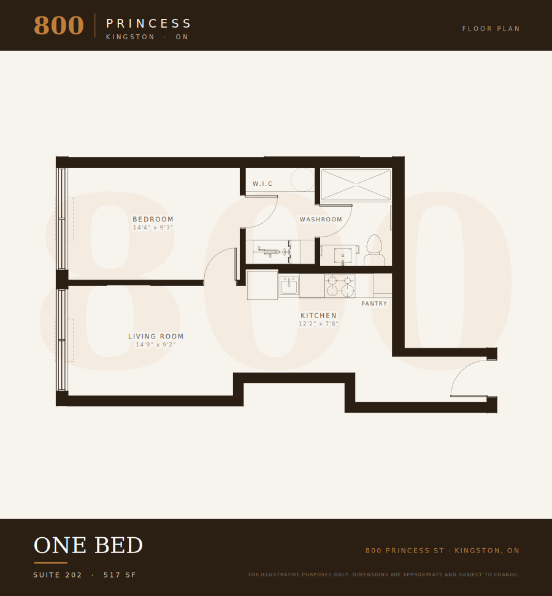

# Floor Plan Sheets

Turn a single-unit CAD floor plan (DXF, or DWG via a converter) into a **branded
marketing sheet** (SVG + PNG) — with room labels placed automatically and a
drag-to-fix editor. Upload a file, pick a
property, export a finished sheet. No coordinate entry.



## What's in this repo

```
app/                              ← the shipping web app (start here)
  backend/      FastAPI service wrapping the rendering engine
  frontend/     Vite + React UI (upload → live preview → export)
  references/   sample CAD/brand inputs + the example output sheet
  rough_work/
    og_scripts/   original prototype engine (reference, not run by the app)
    wip_specs/    engineering spec + the manual workflow it automates
```

The two scripts under [`app/rough_work/og_scripts/`](app/rough_work/og_scripts/)
(`build_floorplan_sheets.py` and `build_floorplan_sheets_with_keyplan.py`) are the
**original prototype** the app was refactored from. `app/backend/engine/render.py`
reproduces their output and is what the app actually runs — the scripts are kept
as the reference, not as dead code.

## Quick start

Two processes. Full setup, troubleshooting, and usage are in
[`app/README.md`](app/README.md) — the short version:

```bash
# 1. backend (port 8000)
cd app/backend
python -m venv .venv && .venv\Scripts\activate    # macOS/Linux: source .venv/bin/activate
pip install -r requirements.txt
uvicorn main:app --reload --port 8000

# 2. frontend (port 5173) — in a second terminal
cd app/frontend
npm install
npm run dev
```

Then open http://localhost:5173. The dev server proxies `/api/*` to the backend,
so there's nothing else to configure.

**Native deps:** PNG output goes through `resvg-py`, a self-contained wheel — no
system Cairo/GTK needed. DWG input is optional and needs the ODA File Converter
(`ODA_CONVERTER` env var); without it, only DXF is accepted.

**Tests:** the backend has a hermetic suite (stdlib `unittest`). Run it from
`app/backend/` with `python -m unittest discover -s tests -p "test_*.py"`.

## Documentation

| Doc | What it covers |
| --- | --- |
| [`app/README.md`](app/README.md) | Setup, running, and the full click-by-click workflow |
| [`CLAUDE.md`](CLAUDE.md) | Architecture, cross-cutting contracts, and gotchas for contributors |
| [`app/rough_work/wip_specs/APP_BUILD_SPEC.md`](app/rough_work/wip_specs/APP_BUILD_SPEC.md) | Engineering spec — *why* the app is built the way it is |
| [`app/rough_work/wip_specs/FLOORPLAN_WORKFLOW.md`](app/rough_work/wip_specs/FLOORPLAN_WORKFLOW.md) | The manual coordinator process this automates |

Read the spec and workflow docs before making non-trivial changes — they encode
the reasoning behind most design decisions.

## Deploying (Vercel)

The app runs as a **single serverless function** on Vercel — one origin serves
both the React UI and the `/api/*` backend. The whole thing is wired through
[`vercel.json`](vercel.json): every route is sent to [`api/index.py`](api/index.py),
which imports the FastAPI app from [`app/backend/main.py`](app/backend/main.py)
and serves the pre-built frontend (`app/frontend/dist/`) as static files.

**Storage.** Serverless filesystems are ephemeral, so file I/O routes through
[`app/backend/storage.py`](app/backend/storage.py), a pluggable backend chosen at
import: if `BLOB_READ_WRITE_TOKEN` is set it uses **Vercel Blob** (persistent,
shared); otherwise it uses the local filesystem exactly as before. Local dev, the
test suite, and any Docker image are untouched — only the Vercel deploy uses Blob.

To deploy:

```bash
# 1. build the frontend and force-add dist (it's gitignored for dev)
cd app/frontend && npm run build && cd ../..
git add app/frontend/dist -f

# 2. in Vercel: create a Public Blob store, connect it to the project
#    (this injects BLOB_READ_WRITE_TOKEN as an env var automatically)

# 3. deploy
vercel --prod
```

**Seeding existing work.** To copy properties/sheets already on your local disk
into the Blob store (so the deployed app shows them), pull the token and run the
one-time seed:

```bash
vercel env pull .env.local --environment=production   # writes BLOB_READ_WRITE_TOKEN
cd app/backend
python seed_blob.py            # properties only
python seed_blob.py --sheets   # also the saved-sheet library
```

It uploads to the same keys the app reads, so the deployed app picks them up on
the next refresh — no redeploy needed. Safe to re-run (it overwrites).

A [`Dockerfile`](Dockerfile) is also included for container hosts (Render, Fly,
Railway): it builds the frontend, then serves everything from uvicorn on port
8000. Without a Blob token it uses the container filesystem (mount a volume to
persist).

## Status

Internal v1. No multi-user accounts, no in-app wall-geometry editing (fix it in
CAD), and key plans are schematic locators, not exact-scale drawings.
